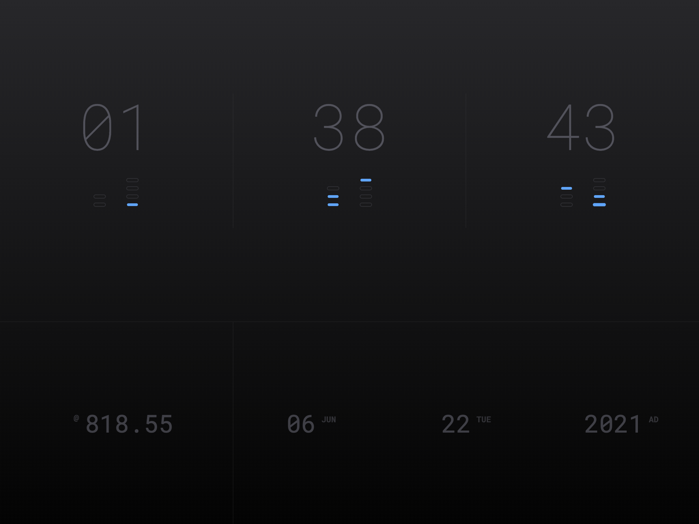

# browser-home

Simple browser home page/new tab page. Uses [tailwindcss](https://github.com/tailwindcss/tailwindcss) and vanilla JS.

**Features:**
* 12 hour clock
* Binary clock
* Beat Internet clock
* Today's date
* Obeys OS UI Light/Dark mode

### Requirements

* [node.js](https://nodejs.org/)

### Usage

1. Download the project and extract to a folder on your system.
2. Open a terminal/command prompt in that folder.
3. Type the following commands:

`npm install` - you only need to do this the first time

`./node_modules/.bin/gulp`

Make your changes to `css`, `js`, `index.html`, `tailwind.config.js`, etc.

Upload the contents of the `live` folder to your web host for your own personal version.